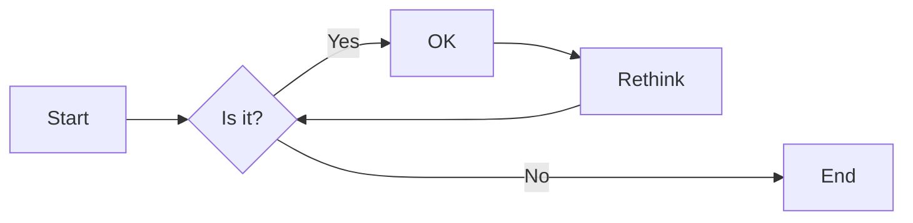
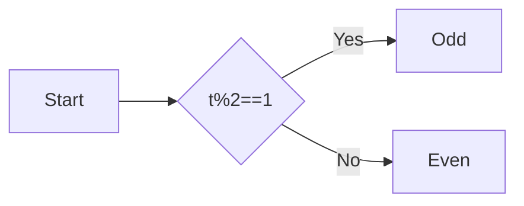

# 实验二 Python变量、简单数据类型

班级： 21计科4班

学号：B20210302412

姓名： 刘巍

Github地址：https://gitee.com/smile-lv/smile

CodeWars地址：<https://www.codewars.com/users/smile>

---

## 实验目的

1. 使用VSCode编写和运行Python程序
2. 学习Python变量和简单数据类型

## 实验环境

1. Git
2. Python 3.10
3. VSCode
4. VSCode插件

## 实验内容和步骤

### 第一部分

实验环境的安装

1. 安装Python，从Python官网下载Python 3.10安装包，下载后直接点击可以安装：[Python官网地址](https://www.python.org/downloads/)
2. 为了在VSCode集成环境下编写和运行Python程序，安装下列VScode插件
   - Python
   - Python Environment Manager
   - Python Indent
   - Python Extended
   - Python Docstring Generator
   - Jupyter
   - indent-rainbow
   - Jinja

---

### 第二部分

Python变量、简单数据类型和列表简介

完成教材《Python编程从入门到实践》下列章节的练习：

- 第2章 变量和简单数据类型

---

### 第三部分

在[Codewars网站](https://www.codewars.com)注册账号，完成下列Kata挑战：

---

#### 第1题：求离整数n最近的平方数（Find Nearest square number）

难度：8kyu

你的任务是找到一个正整数n的最近的平方数
例如，如果n=111，那么nearest_sq(n)（nearestSq(n)）等于121，因为111比100（10的平方）更接近121（11的平方）。
如果n已经是完全平方（例如n=144，n=81，等等），你需要直接返回n。
代码提交地址
<https://www.codewars.com/kata/5a805d8cafa10f8b930005ba>


#### 第2题：弹跳的球（Bouncing Balls）

难度：6kyu

一个孩子在一栋高楼的第N层玩球。这层楼离地面的高度h是已知的。他把球从窗口扔出去。球弹了起来,  例如:弹到其高度的三分之二（弹力为0.66）。他的母亲从离地面w米的窗户向外看,母亲会看到球在她的窗前经过多少次（包括球下落和反弹的时候）？

一个有效的实验必须满足三个条件：

- 参数 "h"（米）必须大于0
- 参数 "bounce "必须大于0且小于1
- 参数 “window "必须小于h。

如果以上三个条件都满足，返回一个正整数，否则返回-1。
**注意:只有当反弹球的高度严格大于窗口参数时，才能看到球。**
代码提交地址
<https://www.codewars.com/kata/5544c7a5cb454edb3c000047/train/python>

---

#### 第3题： 元音统计(Vowel Count)

难度： 7kyu

返回给定字符串中元音的数量（计数）。对于这个Kata，我们将考虑a、e、i、o、u作为元音（但不包括y）。输入的字符串将只由小写字母和/或空格组成。

代码提交地址：
<https://www.codewars.com/kata/54ff3102c1bad923760001f3>

---

#### 第4题：偶数或者奇数（Even or Odd）

难度：8kyu

创建一个函数接收一个整数作为参数，当整数为偶数时返回”Even”当整数位奇数时返回”Odd”。
代码提交地址：
<https://www.codewars.com/kata/53da3dbb4a5168369a0000fe>

### 第四部分

使用Mermaid绘制程序流程图

安装Mermaid的VSCode插件：

- Markdown Preview Mermaid Support
- Mermaid Markdown Syntax Highlighting

使用Markdown语法绘制你的程序绘制程序流程图（至少一个），Markdown代码如下：


显示效果如下：



查看Mermaid流程图语法-->[点击这里](https://mermaid.js.org/syntax/flowchart.html)

使用Markdown编辑器（例如VScode）编写本次实验的实验报告，包括[实验过程与结果](#实验过程与结果)、[实验考查](#实验考查)和[实验总结](#实验总结)，并将其导出为 **PDF格式** 来提交。

## 实验过程与结果

请将实验过程与结果放在这里，包括：

- [第二部分 Python变量、简单数据类型和列表简介](#第二部分)
- * 练习2.3
```python
  name='twk'
  print(f"Hello {name},would you like to learn Python today?")
```

```
Hello twk,would you like to learn Python today?
```
* 练习2.4
 ```python
name='twk'
print(name.title())
print(name.upper())
print(name.lower())
 ```
```
Twk
TWK
twk
```
* 练习2.5
```python
str="孔子说：“学而不思则罔”"
print(str)
```
```
孔子说：“学而不思则罔”
```
* 练习2.6
```python
name="孔子说："
message="学而不思则罔"
print(name+message)
```
```
孔子说：学而不思则罔
```
* 练习2.7
```python
name= ' \t twk \n '
print(name)
name.rstrip()
name.lstrip()
name.strip()
print(name)
```
```
 	 twk 
 
 	 twk
```
* 练习2.8
```python
filename='python_notes.txt'
print(filename.removesuffix('.txt'))

```
```
python_notes
```
- [第三部分 Codewars Kata挑战](#第三部分)
* 第1题：求离整数n最近的平方数（Find Nearest square number）
```python
import math
def nearest_sq(n):
    # pass
    s=math.sqrt(n)
    temp=round(s)*round(s)
    return temp


```

* 第2题：弹跳的球（Bouncing Balls）
```python
 temp=0
    while h>window and  0<bounce<1 and h>0:
        h=h*bounce
        temp=temp+2
    return temp-1
```
* 第3题： 元音统计(Vowel Count)
  ```def get_count(sentence):
    pass
    vowels = 'aeiou'  
    count = 0  
    for char in sentence:  
        if char in vowels:  
            count += 1  
    return count```
*  第4题：偶数或者奇数（Even or Odd）
 ```def even_or_odd(number):
    temp=number%2
    if temp==1:
        return "Odd"
    else :
        return "Even"
```

- [第四部分 使用Mermaid绘制程序流程图](#第四部分)



**注意：不要使用截图，Markdown文档转换为Pdf格式后，截图可能会无法显示。**

## 实验考查

请使用自己的语言并使用尽量简短代码示例回答下面的问题，这些问题将在实验检查时用于提问和答辩以及实际的操作。

1. Python中的简单数据类型有那些？我们可以对这些数据类型做哪些操作？<br>
主要有整形，浮点型，复数，布尔型，字符串。
对于整形，浮点型，复数可以进行加减乘除操作幂运算，取余。<br>
布尔型可以进行逻辑运算如与（and）、或（or）、非（not）。<br>
字符串可以进行拼接、切片、查找、替换等操作。

2. 为什么说Python中的变量都是标签？<br>
  在Python中，变量被视为标签，这是因为它们并不直接存储值。相反，它们是指向存储在内存中的对象的引用。当创建一个变量并为其赋值时，Python会在内存中创建一个对象来存储该值，然后将变量的名称（即标签）与该对象关联起来。<br>
3. 有哪些方法可以提高Python代码的可读性？<br>
   遵行代码的编写规范，使用有意义的变量名，使用合理的注释，对空格和缩进进行规范吗，优化算法，使用简洁的代码，降低复杂性。

## 实验总结
此次实验接触了python代码简单的加减乘除和列表的查询功能，比较简单，同时学会在vscode中使用Mermaid绘制程序流程图，也比较简单，综合难度不大。