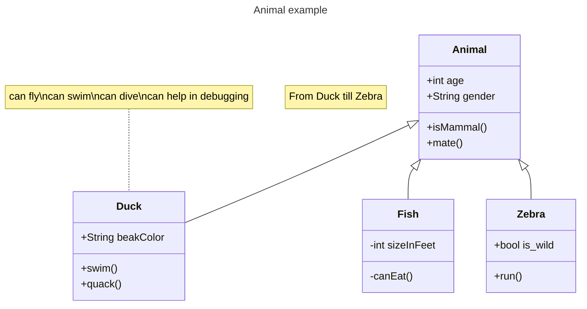
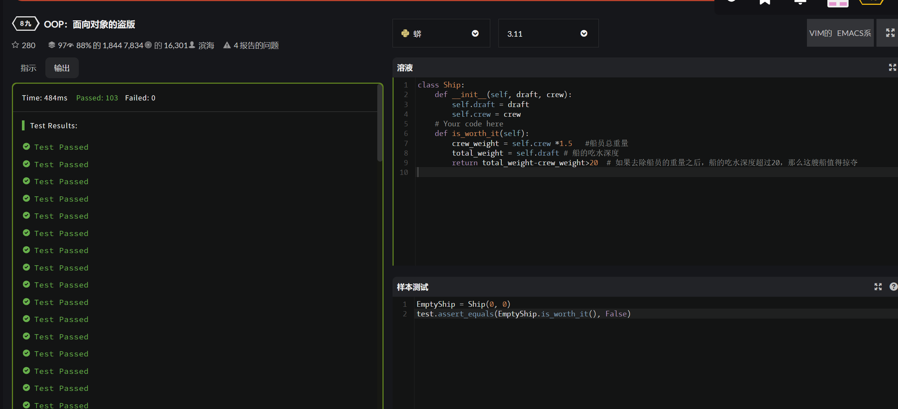
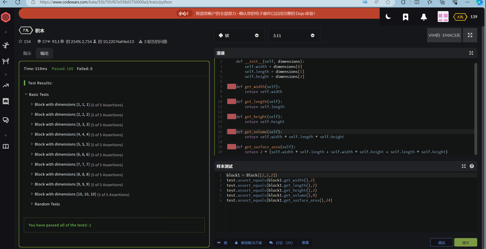
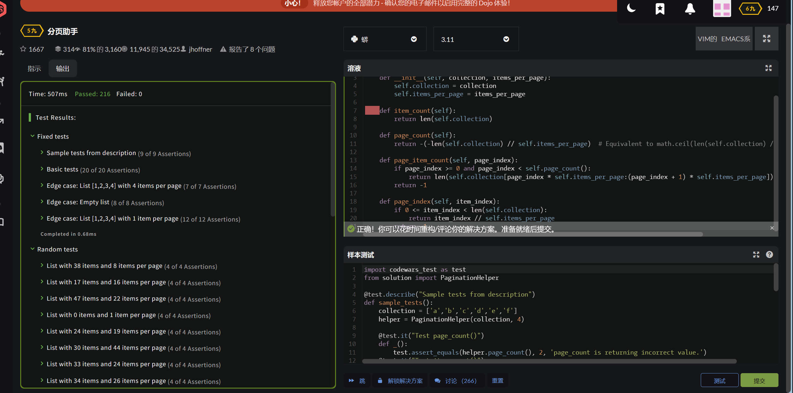
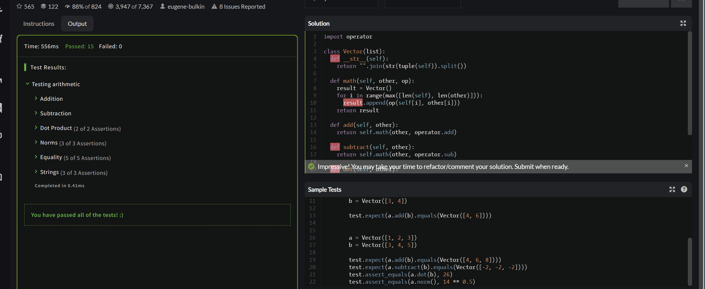
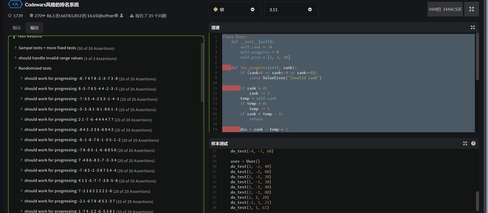
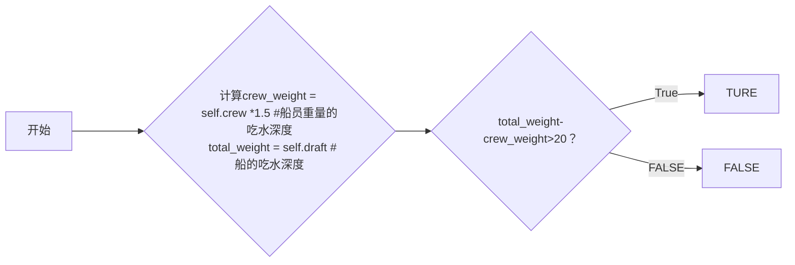

# 实验七 Python面向对象编程

班级： 21计科04

学号： B20210302412

姓名： 刘巍

Gitee地址：(https://github.com/smile-lv/smile)

CodeWars地址：<https://www.codewars.com/users/Strugglingtt>

---
---

## 实验目的

1. 学习Python类和继承的基础知识
2. 学习namedtuple和DataClass的使用

## 实验环境

1. Git
2. Python 3.10
3. VSCode
4. VSCode插件

## 实验内容和步骤

### 第一部分

Python面向对象编程

完成教材《Python编程从入门到实践》下列章节的练习：

- 第9章 类

---

### 第二部分

在[Codewars网站](https://www.codewars.com)注册账号，完成下列Kata挑战：

---

#### 第一题：面向对象的海盗

难度： 8kyu

啊哈，伙计!

你是一个小海盗团的首领。而且你有一个计划。在OOP的帮助下，你希望建立一个相当有效的系统来识别船上有大量战利品的船只。
对你来说，不幸的是，现在的人很重，那么你怎么知道一艘船上装的是黄金而不是人呢？

你首先要写一个通用的船舶类。

```python
class Ship:
    def __init__(self, draft, crew):
        self.draft = draft
        self.crew = crew
```

每当你的间谍看到一艘新船进入码头，他们将根据观察结果创建一个新的船舶对象。

- `draft`吃水 - 根据船在水中的高度来估计它的重量
- `crew`船员 - 船上船员的数量

`Titanic = Ship(15, 10)`

任务

你可以访问船舶的 "draft(吃水) "和 "crew(船员)"。"draft(吃水) "是船的总重量，"船员 "是船上的人数。
每个船员都会给船的吃水增加1.5个单位。如果除去船员的重量后，吃水仍然超过20，那么这艘船就值得掠夺。任何有这么重的船一定有很多战利品!
添加方法
`is_worth_it`
来决定这艘船是否值得掠夺。

例如：

```python
Titanic.is_worth_it()
False
```

祝你好运，愿你能找到金子!

代码提交地址：
<https://www.codewars.com/kata/54fe05c4762e2e3047000add>

---

#### 第二题： 搭建积木

难度：7kyu

写一个创建Block的类（Duh.）
构造函数应该接受一个数组作为参数，这个数组将包含3个整数，其形式为`[width, length, height]`，Block应该由这些整数创建。

定义这些方法:

- `get_width()` return the width of the `Block`
- `get_length()` return the length of the `Block`
- `get_height()` return the height of the `Block`
- `get_volume()` return the volume of the `Block`
- `get_surface_area()` return the surface area of the `Block`

例子：

```python
b = Block([2,4,6]) # create a `Block` object with a width of `2` a length of `4` and a height of `6`
b.get_width() # return 2    
b.get_length() # return 4
b.get_height() # return 6
b.get_volume() # return 48
b.get_surface_area() # return 88
```

注意： 不需要检查错误的参数。

代码提交地址：
<https://www.codewars.com/kata/55b75fcf67e558d3750000a3>

---

#### 第三题： 分页助手

难度：5kyu

在这个练习中，你将加强对分页的掌握。你将完成PaginationHelper类，这是一个实用类，有助于查询与数组有关的分页信息。
该类被设计成接收一个值的数组和一个整数，表示每页允许多少个项目。集合/数组中包含的值的类型并不相关。

下面是一些关于如何使用这个类的例子：

```python
helper = PaginationHelper(['a','b','c','d','e','f'], 4)
helper.page_count() # should == 2
helper.item_count() # should == 6
helper.page_item_count(0)  # should == 4
helper.page_item_count(1) # last page - should == 2
helper.page_item_count(2) # should == -1 since the page is invalid

# page_index takes an item index and returns the page that it belongs on
helper.page_index(5) # should == 1 (zero based index)
helper.page_index(2) # should == 0
helper.page_index(20) # should == -1
helper.page_index(-10) # should == -1 because negative indexes are invalid
```

代码提交地址：
<https://www.codewars.com/kata/515bb423de843ea99400000a>


---

#### 第四题： 向量（Vector）类

难度： 5kyu

创建一个支持加法、减法、点积和向量长度的向量（Vector）类。

举例来说：

```python
a = Vector([1, 2, 3])
b = Vector([3, 4, 5])
c = Vector([5, 6, 7, 8])

a.add(b)      # should return a new Vector([4, 6, 8])
a.subtract(b) # should return a new Vector([-2, -2, -2])
a.dot(b)      # should return 1*3 + 2*4 + 3*5 = 26
a.norm()      # should return sqrt(1^2 + 2^2 + 3^2) = sqrt(14)
a.add(c)      # raises an exception
```

如果你试图对两个不同长度的向量进行加减或点缀，你必须抛出一个错误。
向量类还应该提供：

- 一个 `__str__` 方法，这样 `str(a) === '(1,2,3)'` 
- 一个equals方法，用来检查两个具有相同成分的向量是否相等。

注意：测试案例将利用用户提供的equals方法。

代码提交地址：
<https://www.codewars.com/kata/526dad7f8c0eb5c4640000a4>

---

#### 第五题： Codewars风格的等级系统

难度： 4kyu

编写一个名为User的类，用于计算用户在类似于Codewars使用的排名系统中的进步量。

业务规则：

- 一个用户从等级-8开始，可以一直进步到8。
- 没有0（零）等级。在-1之后的下一个等级是1。
- 用户将完成活动。这些活动也有等级。
- 每当用户完成一个有等级的活动，用户的等级进度就会根据活动的等级进行更新。
- 完成活动获得的进度是相对于用户当前的等级与活动的等级而言的。
- 用户的等级进度从零开始，每当进度达到100时，用户的等级就会升级到下一个等级。
- 在上一等级时获得的任何剩余进度都将被应用于下一等级的进度（我们不会丢弃任何进度）。例外的情况是，如果没有其他等级的进展（一旦你达到8级，就没有更多的进展了）。
- 一个用户不能超过8级。
- 唯一可接受的等级值范围是-8,-7,-6,-5,-4,-3,-2,-1,1,2,3,4,5,6,7,8。任何其他的值都应该引起错误。

逻辑案例：

- 如果一个排名为-8的用户完成了一个排名为-7的活动，他们将获得10的进度。
- 如果一个排名为-8的用户完成了排名为-6的活动，他们将获得40的进展。
- 如果一个排名为-8的用户完成了排名为-5的活动，他们将获得90的进展。
- 如果一个排名-8的用户完成了排名-4的活动，他们将获得160个进度，从而使该用户升级到排名-7，并获得60个进度以获得下一个排名。
- 如果一个等级为-1的用户完成了一个等级为1的活动，他们将获得10个进度（记住，零等级会被忽略）。

代码案例：

```python
user = User()
user.rank # => -8
user.progress # => 0
user.inc_progress(-7)
user.progress # => 10
user.inc_progress(-5) # will add 90 progress
user.progress # => 0 # progress is now zero
user.rank # => -7 # rank was upgraded to -7
```

代码提交地址：
<https://www.codewars.com/kata/51fda2d95d6efda45e00004e>

---

### 第三部分

使用Mermaid绘制程序的**类图**

安装VSCode插件：

- Markdown Preview Mermaid Support
- Mermaid Markdown Syntax Highlighting

使用Markdown语法绘制你的程序绘制程序类图（至少一个），Markdown代码如下：


显示效果如下：



查看Mermaid类图的语法-->[点击这里](https://mermaid.js.org/syntax/classDiagram.html)

使用Markdown编辑器（例如VScode）编写本次实验的实验报告，包括[实验过程与结果](#实验过程与结果)、[实验考查](#实验考查)和[实验总结](#实验总结)，并将其导出为 **PDF格式** 来提交。

## 实验过程与结果

请将实验过程与结果放在这里，包括：

- [第一部分 Python面向对象编程](#第一部分)
- [第二部分 Codewars Kata挑战](#第二部分)
#### 第一题：面向对象的海盗
```python
class Ship:
    def __init__(self, draft, crew):
        self.draft = draft
        self.crew = crew
    # Your code here
    def is_worth_it(self):  
        crew_weight = self.crew *1.5   #船员总重量
        total_weight = self.draft # 船的吃水深度  
        return total_weight-crew_weight>20  # 如果去除船员的重量之后，船的吃水深度超过20，那么这艘船值得掠夺
```

#### 第二题： 搭建积木
```python 
class Block:  
    def __init__(self, dimensions):  
        self.width = dimensions[0]  
        self.length = dimensions[1]  
        self.height = dimensions[2]  
  
    def get_width(self):  
        return self.width  
  
    def get_length(self):  
        return self.length  
  
    def get_height(self):  
        return self.height  
  
    def get_volume(self):  
        return self.width * self.length * self.height  
  
    def get_surface_area(self):  
        return 2 * (self.width * self.length + self.width * self.height + self.length * self.height)
```

#### 第三题： 分页助手
```python
class PaginationHelper:  
      
    def __init__(self, collection, items_per_page):  
        self.collection = collection  
        self.items_per_page = items_per_page  
      
    def item_count(self):  
        return len(self.collection)  
      
    def page_count(self):  
        return -(-len(self.collection) // self.items_per_page)  # Equivalent to math.ceil(len(self.collection) / self.items_per_page)  
      
    def page_item_count(self, page_index):  
        if page_index >= 0 and page_index < self.page_count():  
            return len(self.collection[page_index * self.items_per_page:(page_index + 1) * self.items_per_page])  
        return -1  
      
    def page_index(self, item_index):  
        if 0 <= item_index < len(self.collection):  
            return item_index // self.items_per_page  
        return -1
```

#### 第四题： 向量（Vector）类
```python
import operator

class Vector(list):
  def __str__(self):
    return "".join(str(tuple(self)).split())

  def math(self, other, op):
    result = Vector()
    for i in range(max([len(self), len(other)])):
      result.append(op(self[i], other[i]))
    return result

  def add(self, other):
    return self.math(other, operator.add)
    
  def subtract(self, other):
    return self.math(other, operator.sub)
    
  def dot(self, other):
    return sum(self.math(other, operator.mul))
    
  def norm(self):
    return self.dot(self) ** 0.5
    
  def equals(self, other):
    return self == other
```

#### 第五题： Codewars风格的等级系统
```python
class User:  
    def __init__(self):  
        self.rank = -8  
        self.progress = 0  
        self.pros = [1, 3, 10]  
  
    def inc_progress(self, rank):  
        if (rank>8 or rank<-8 or rank==0):  
            raise ValueError("Invalid rank")  
          
        if rank > 0:  
            rank -= 1  
        temp = self.rank  
        if temp > 0:  
            temp -= 1  
        if rank < temp - 1:  
            return  
  
        dis = rank - temp + 1  
        d = 1  
        if dis > 1:  
            d = dis - 1  
            dis = 2  
  
        self.progress += self.pros[dis] * d * d  
  
        if self.progress >= 100:  
            pos = temp + self.progress // 100  
            if pos>7:
                temp=7
            else:
                temp=pos
            if temp >= 0:  
                self.rank = temp + 1
            else:
                self.rank=temp
        if self.rank == 8:  
            self.progress = 0  
        else:  
            self.progress %= 100
```

- [第三部分 使用Mermaid绘制程序流程图](#第三部分)
#### 第一题：面向对象的海盗


## 实验考查

请使用自己的语言并使用尽量简短代码示例回答下面的问题，这些问题将在实验检查时用于提问和答辩以及实际的操作。

1. Python的类中__init__方法起什么作用？
   
   在Python中，__init__方法是一个特殊的方法，通常用于类的初始化。当你创建一个类的实例
   __init__方法会被自动调用，以便对新创建的对象进行必要的初始化。
具体来说，__init__方法允许类接受初始参数，这样你就可以在创建对象时设置属性

2. Python语言中如何继承父类和改写（override）父类的方法。

 在Python中，继承是面向对象编程的一个核心概念。它允许我们在已有的类（父类或基类）的基础上创建新的类（子类）。子类继承了父类的所有属性和方法，同时还可以添加自己的属性和方法。

改写父类的方法通常是为了在子类中根据需要改变或扩展父类方法的行为。

以下是一个简单的示例来说明如何在Python中继承父类和改写父类的方法：
```python
python
# 定义一个父类  
class Animal:  
    def __init__(self, name):  
        self.name = name  
  
    def speak(self):  
        print(f"{self.name} makes a noise")  
  
# 定义一个子类 Dog，继承自 Animal  
class Dog(Animal):  
    def __init__(self, name):  
        super().__init__(name)  # 调用父类的构造函数  
  
    # 改写父类的 speak 方法  
    def speak(self):  
        print(f"{self.name} barks")  
  
# 创建一个 Dog 实例并调用它的 speak 方法  
dog = Dog("Fido")  
dog.speak()  # 输出 "Fido barks"
```
3. Python类有那些特殊的方法？它们的作用是什么？请举三个例子并编写简单的代码说明。

Python类中有很多特殊的方法，这些方法以双下划线开头和结尾，例如__init__, __str__, __del__等。这些特殊方法在Python中被称为"魔法方法"或者"双下划线方法"。它们可以改变类的行为或者提供类的接口。以下举三个例子：

__init__: 这是一个构造器方法，当一个对象被创建时，这个方法会被自动调用。它可以用来初始化对象的属性。

python
class MyClass:  
    def __init__(self, name):  
        self.name = name  
  
obj = MyClass('John')  
print(obj.name)  # 输出: John
__str__: 这个方法在调用print函数或者使用str()函数时会被调用，返回一个对象的可打印字符串表示。

python
class MyClass:  
    def __init__(self, name):  
        self.name = name  
    def __str__(self):  
        return f'My name is {self.name}'  
  
obj = MyClass('John')  
print(obj)  # 输出: My name is John
__del__: 当一个对象被销毁时，这个方法会被调用。通常这个方法用来清理资源，例如关闭文件或者网络连接等。但是请注意，Python的垃圾收集机制并不能保证__del__方法一定会被调用，所以不应该过度依赖这个方法。

python
class MyClass:  
    def __init__(self, name):  
        self.name = name  
    def __del__(self):  
        print(f'{self.name} is deleted')  
  
obj = MyClass('John')  
del obj  # 输出: John is deleted
以上就是三个特殊的Python类方法的例子和简单的说明。其他的特殊方法还有很多，例如__getitem__, __setitem__, __call__等等，可以根据实际需要使用。
## 实验总结
此次实验是最后依次实验，实验的难度不高，但是对类的编写的熟悉程度要求熟练，还有对题目的阅读能力的要求较为高。